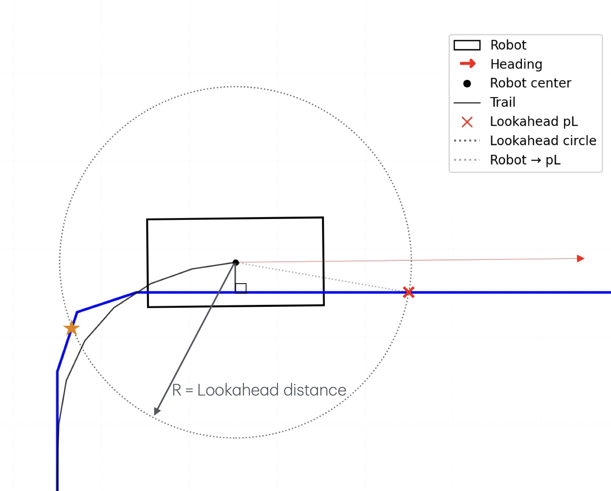
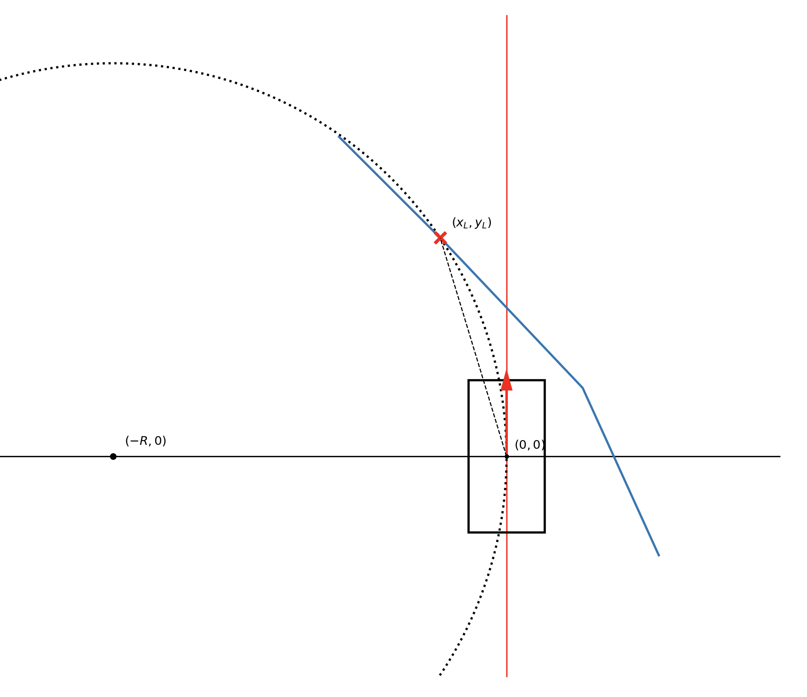

# Pure Pursuit Controller

This controller tracks a **polyline path** by repeatedly selecting a **lookahead point** at a fixed distance `L`
and commanding a circular arc (curvature) that drives the robot toward that point.

**Inputs**
- Robot pose: `(x, y, yaw)` in world frame
- Path polyline: `P = [(x0,y0), (x1,y1), ...]`
- Parameters: lookahead distance `L`, local window size `W`, small backtracking tolerance `eps_back`

**Outputs**
- Velocity command: `(v, ω)`
- (Optional) the chosen lookahead point for visualization/debug: `p_L`

---

## 3-step implementation summary

### 1) Select lookahead point at fixed distance `L`
We choose a lookahead point `p_L` by intersecting the **robot-centered circle** (radius `L`) with the **path polyline**.

To keep this stable and efficient:
- We compute a **progress segment index** from the robot’s projection onto the path (which segment we are “on”).
- We search only a **local window** of segments near that index (`window_W`).
- We choose the **first valid intersection ahead of the robot** (allowing a small backtrack margin `eps_back`).

  

*Circle–path intersection with forward choice of the lookahead hit (×), restricted to a local search window.*

---
### 2) Convert lookahead point to curvature (robot-frame geometry)
Transform the chosen lookahead point into the robot/body frame:

- `p_L_world → p_L_body = (x_L, y_L)`

Pure Pursuit fits a circular arc that:
1. passes through the robot origin,
2. is tangent to the robot heading at the origin (body +x axis),
3. passes through `p_L = (x_L, y_L)`.

A concise geometric derivation:

- Tangency at the origin ⇒ the circle center lies on the body **y-axis**: `C = (0, R)`.
- Enforce `p_L` on the circle:

$$
\|(x_L,y_L)-(0,R)\|^2 = R^2
\;\Rightarrow\;
x_L^2 + (y_L - R)^2 = R^2
\;\Rightarrow\;
R = \frac{x_L^2+y_L^2}{2y_L} = \frac{L^2}{2y_L}
$$

Therefore the curvature is:

$$
\kappa = \frac{1}{R} = \frac{2y_L}{L^2}
$$

  

*Robot-frame view: lookahead point determines turning circle and curvature sign.*

---

### 3) Generate command `(v, ω)`
We choose a **speed policy** for forward motion (e.g., `v = max_vel` or a heuristic schedule), and set the turn rate from the geometric curvature.

A path curvature `κ` means the robot’s center follows a circle of radius `R = 1/κ`. For motion along a circle, arc length satisfies
`ds = R dθ`. Differentiating gives

$$
v = \frac{ds}{dt} = R\frac{d\theta}{dt} = R\omega
\quad\Rightarrow\quad
\omega = \frac{v}{R} = v\kappa .
$$

Intuition that works for me: imagine a camera that **translates with the robot** but does not rotate. As the robot moves around the circle, its heading must rotate at exactly the rate needed to stay tangent to the path—like a “tidally locked” moon whose orientation changes one full turn per full revolution around earth.
$$
\omega = v\,\kappa
$$

---
